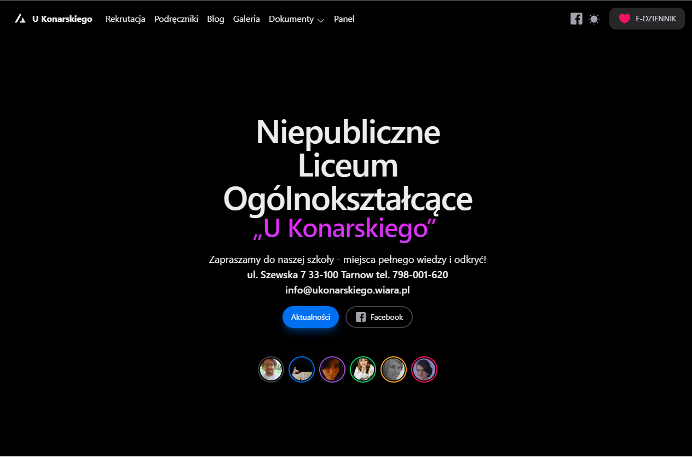
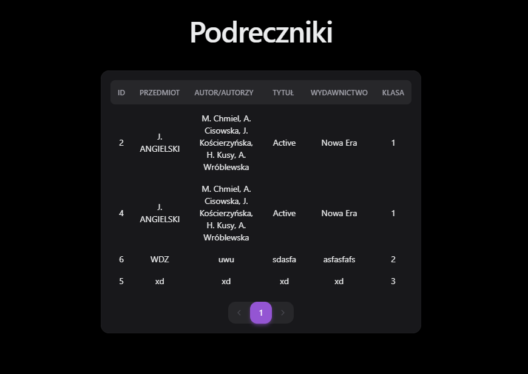
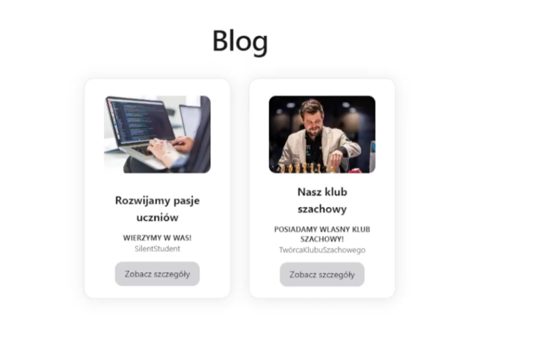
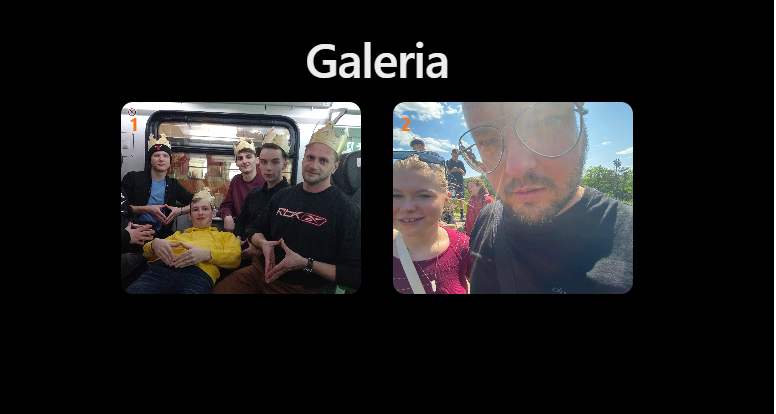
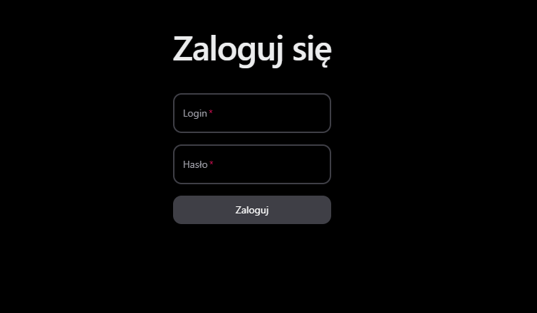

# 🏫 UKonarskiego Tarnów

**UKonarskiego Tarnów** to nowoczesna strona internetowa dla Szkoły Podstawowej im. UKonarskiego w Tarnowie. Zbudowana z wykorzystaniem React, Tailwind CSS, Next.js, NextUI i TypeScript, strona oferuje szereg funkcji dla uczniów, nauczycieli i rodziców.

## 💜 Funkcje

- **Tabela Książek**  
  Przeglądaj książki dostępne w szkole z możliwością filtrowania według klasy i kategorii. Można wyszukiwać książki według tytułu, autora, ISBN oraz filtrować je według przedmiotu i klasy.

- **Blog Szkolny**  
  Aktualności i ogłoszenia dotyczące różnych wydarzeń szkolnych, takich jak zajęcia koła szachowego i inne ważne informacje dla społeczności szkolnej.

- **Galeria Zdjęć**  
  Przeglądaj zdjęcia z wydarzeń szkolnych oraz codziennego życia szkoły. Możliwość dodawania nowych zdjęć przez panel administracyjny.

- **Panel Administracyjny**  
  Narzędzie dla nauczycieli do zarządzania treściami na stronie. Obejmuje zarządzanie książkami, wpisami na blogu oraz galerią zdjęć. Zintegrowany z bazą danych i chmurą AWS.

- **Responsywny Design**  
  Strona jest w pełni responsywna, co zapewnia komfortowe przeglądanie na różnych urządzeniach, od komputerów stacjonarnych po smartfony.

- **Zaawansowane Filtrowanie i Wyszukiwanie**  
  Rozbudowane opcje wyszukiwania i filtrowania książek według klasy, autora, tytułu i innych kryteriów, co ułatwia użytkownikom znalezienie potrzebnych materiałów.

- **Integracja z AWS**  
  Używamy chmury AWS do przechowywania danych, zarządzania plikami oraz zapewnienia stabilności i bezpieczeństwa aplikacji.

## 📸 Zrzuty Ekranu

    
    
    
    

## 🚀 Technologie

- **React** - Biblioteka do budowy interfejsów użytkownika.
- **Next.js** - Framework do tworzenia aplikacji React z obsługą serwerowej strony renderowania.
- **Tailwind CSS** - Framework CSS do szybkiego projektowania nowoczesnych interfejsów użytkownika.
- **NextUI** - Komponenty UI do szybkiego tworzenia atrakcyjnych interfejsów.
- **TypeScript** - Superset JavaScriptu z typowaniem statycznym.
- **AWS** - Usługi chmurowe do przechowywania danych i zarządzania backendem.
- **PostgreSQL** - Relacyjna baza danych do przechowywania danych o książkach, wpisach na blogu i innych treściach.

## 📖 Dokumentacja

Pełna dokumentacja projektu znajduje się w [dokumentacji](docs/README.md). Znajdziesz tam szczegóły dotyczące struktury projektu, instrukcje dotyczące rozwoju i wdrożenia, oraz informacje o dostępnych API.

## 🤝 Współpraca

Jeśli chcesz dołożyć swoją cegiełkę do projektu, zapraszam do składania **issue** lub **pull requestów**. Więcej informacji znajdziesz w [Wytycznych Wkładu](CONTRIBUTING.md).

## 📧 Kontakt

Masz pytania? Skontaktuj się ze mną pod adresem [twoj.email@example.com](mailto:twoj.email@example.com).

## 📝 Licencja

Projekt jest udostępniony na licencji **MIT**. Szczegóły znajdują się w pliku [LICENSE](LICENSE).
